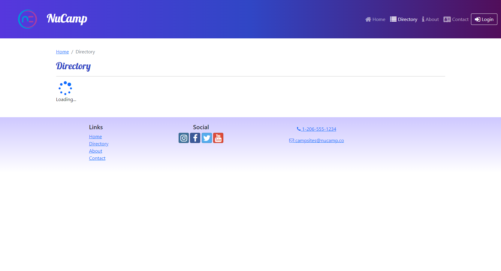

# Nucampsite Project built with React
### This React project is based on a fictional campsite. The website has been built with React and incorporates various features and tools, including state management with Redux and routing with React Router.

## Main Features:
- State management with Redux.
- Single-page application with multiple routes using React Router.
- Asynchronous functions that connect the page to its assets to a local JSON server.
- Forms built with Formik.

## Screenshot of the Home Page:

## Screenshot of the Directory Page showing the loading component waiting for a response from the server:

## The following screenshot includes the page of one of the camps. Here, we can see the different comments associated with this object, as well as the button to add new comments, which will be displayed in the list after submission:

